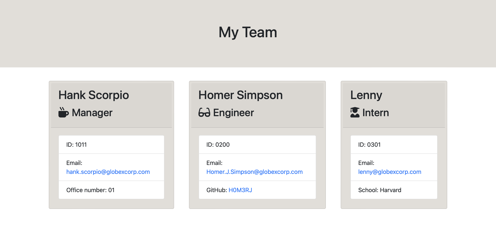

# get-team-info
Simple command line application which will generate HTML page detailing team member information.

Team members are created as objects extending and underlying employee class.

## User Story

As a manager a user want to generate a webpage that displays my team's basic info so that a user have quick access to their emails and GitHub profiles.

## Instructions

To use, clone repo from github and run `npm install` to install dependencies.  Then run `node index.js` to start the application.  Follow the prompts to enter team member information.  When finished, select the option to finish building the team.  The application will generate an HTML file in the output folder.

Example of the application running:

## Functionality
The application takes in user input through a command line application built with inquirer. 

A user must initially provide information about a Manager. Once information about a manager is entered the user can end the program, or add further employees of the type Engineer or Intern. There is no limit to the number of either of these employees that a user can add.

Once the user elects to end the program, the application will generate an HTML file in the output folder.  The HTML file will contain a card for each employee entered.  The cards will contain the employee's name, role, id, email, and a role specific property (office number for manager, github username for engineer, and school for intern).

Example of the command line application running:

## Tests

This application uses jest to test the functionality of the code. It is advised to run tests following installation to ensure that all assets are installed correctly.  To run the tests, run `npm run test` from the command line. All tests should pass if repo is cloned from github and dependencies are installed.

## Credit
Credit to the creators of inquirer, jest, and fs.  Credit to the creators of the starter code for this project. 

